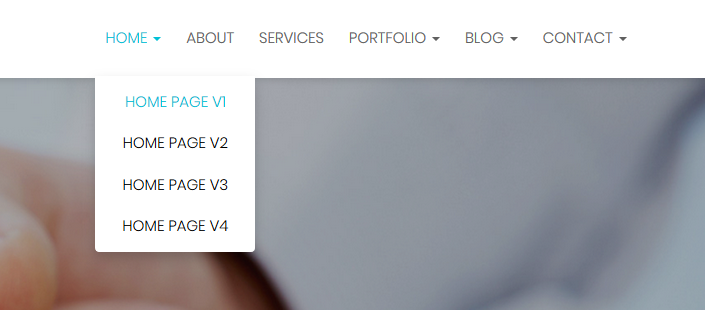
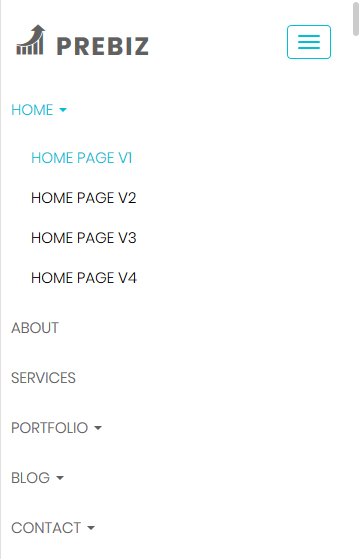

# Site Navigation





### Site Navigation HTML Code {#site-navigation-html-code}

The below code can be found in all HTML pages that are included with the theme. code will be placed from 82th to 148th line of each page.

```markup
<ul class="nav navbar-nav underline">
    <li class=" dropdown  active "><a href="#" title="HOME" id="home"
                                      data-toggle="dropdown">HOME <span
            class="caret"></span></a>
        <ul class="dropdown-menu">
            <li class=" active "><a href="index.html" title="HOME PAGE V1"
                                    id="home-page-1">HOME PAGE V1</a></li>
            <li class=""><a href="home-page-v2.html" title="HOME PAGE V2"
                            id="home-page-2">HOME PAGE V2</a></li>
            <li class=""><a href="home-page-v3.html" title="HOME PAGE V3"
                            id="home-page-3">HOME PAGE V3</a></li>
            <li class=""><a href="home-page-v4.html" title="HOME PAGE V4"
                            id="home-page-4">HOME PAGE V4</a></li>
        </ul>
    </li>
    <li class=""><a href="about-us-v1.html" title="ABOUT" id="about-page">ABOUT</a></li>
    <li class=""><a href="services-v1.html" title="SERVICES" id="services">SERVICES</a>
    </li>
    <li class=" dropdown "><a href="#" title="PORTFOLIO" id="portfolio-page"
                              data-toggle="dropdown">PORTFOLIO <span
            class="caret"></span></a>
        <ul class="dropdown-menu">
            <li class=""><a href="portfolio-v1.html" title="PORTFOLIO V1"
                            id="portfolio-v1">PORTFOLIO V1</a></li>
            <li class=""><a href="portfolio-v2.html" title="PORTFOLIO V2"
                            id="portfolio-v2">PORTFOLIO V2</a></li>
            <li class=""><a href="portfolio-v3.html" title="PORTFOLIO V3"
                            id="portfolio-v3">PORTFOLIO V3</a></li>
            <li class=""><a href="portfolio-single-v1.html" title="SIGNLE PORTFOLIO 1"
                            id="single-portfolio-1">SIGNLE PORTFOLIO 1</a></li>
            <li class=""><a href="portfolio-single-v2.html" title="SIGNLE PORTFOLIO 2"
                            id="single-portfolio-2">SIGNLE PORTFOLIO 2</a></li>
        </ul>
    </li>
    <li class=" dropdown "><a href="#" title="BLOG" id="blog-page"
                              data-toggle="dropdown">BLOG <span
            class="caret"></span></a>
        <ul class="dropdown-menu">
            <li class=""><a href="blog-grid.html" title="BLOG GRID" id="blog-grid">BLOG
                GRID</a></li>
            <li class=""><a href="blog-list-left-sidebar.html" title="BLOG LEFT SIDEBAR"
                            id="blog-left-sidebar">BLOG LEFT SIDEBAR</a></li>
            <li class=""><a href="blog-list-right-sidebar.html"
                            title="BLOG RIGHT SIDEBAR" id="blog-right-sidebar">BLOG
                RIGHT SIDEBAR</a></li>
            <li class=""><a href="single-blog-left-sidebar.html"
                            title="SINGLE BLOG LEFT SIDEBAR"
                            id="single-blog-left-sidebar">SINGLE BLOG LEFT SIDEBAR</a>
            </li>
            <li class=""><a href="single-blog-right-sidebar.html"
                            title="SINGLE BLOG RIGHT SIDEBAR"
                            id="single-blog-right-sidebar">SINGLE BLOG RIGHT SIDEBAR</a>
            </li>
        </ul>
    </li>
    <li class=" dropdown "><a href="contact.html" title="CONTACT" id="contact"
                              data-toggle="dropdown">CONTACT <span class="caret"></span></a>
        <ul class="dropdown-menu">
            <li class=""><a href="contact.html" title="CONTACT V1" id="contact-v1">CONTACT
                V1</a></li>
            <li class=""><a href="contact-v2.html" title="CONTACT V2" id="contact-v2">CONTACT
                V2</a></li>
            <li class=""><a href="contact-v3.html" title="CONTACT V3" id="contact-v3">CONTACT
                V3</a></li>
        </ul>
    </li>
</ul>
```

